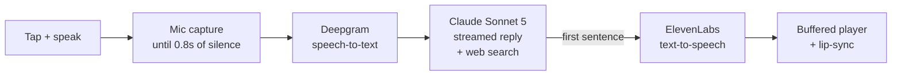

# Mershy

<p align="center">
  
</p>

<p align="center">
  <b>A pocket-sized, Tamagotchi-style AI buddy you can talk to.</b><br>
  Tap the round AMOLED screen, say something, and Mershy answers out loud,<br>
  with a face that blinks, emotes and lip-syncs, powered by Claude.
</p>

---

## What it does

- **Voice conversations:** tap, talk, and get a spoken reply in about 2 seconds.
- **An animated face:** Mershy is a cartoon portrait of Mehrshad. He blinks, glances around, changes expression with his mood, and moves his mouth in time with his voice.
- **Memory:** he remembers the last 10 exchanges, so follow-up questions work.
- **Web search:** he can look things up, like opening hours, weather, news or scores, using Claude's built-in web search.
- **Knows his own state:** ask him the time, his volume or his battery level.
- **Volume:** swipe up and down on the screen, or just ask ("turn it down").
- **Battery indicator:** swipe to see the percentage, with ⚡ while plugged in.
- **Low-power sleep:** press BOOT, or leave him alone for 3 minutes. Tap to wake.
- **Roams between WiFi networks:** say, home WiFi and a phone hotspot.

## Hardware

[Waveshare ESP32-S3-Touch-AMOLED-1.75C](https://www.waveshare.com/). This is the **C** variant, which matters: the audio clock pin differs from the plain 1.75.

| Part | Details |
|---|---|
| Display | 1.75" 466×466 round AMOLED (SH8601, QSPI) |
| Touch | CST9217 capacitive |
| Audio | ES8311 speaker codec + ES7210 mic array codec |
| Power | AXP2101 PMIC with fuel gauge, optional LiPo battery |
| MCU | ESP32-S3, 16 MB flash, 8 MB PSRAM |

## How it works



All API calls go **directly from the device** over HTTPS; there's no server in between. The speed comes from:
- opening the HTTPS connections while you're still talking
- streaming Claude's reply and speaking the first sentence as soon as it's written
- downloading the next piece of speech while the current one plays

End of speech to first word is about **2.2 s**.

## Setup

### 1. Prerequisites

- [PlatformIO](https://platformio.org/) (CLI or the VS Code extension)
- API keys for **Anthropic** (Claude), **Deepgram** (speech-to-text) and **ElevenLabs** (voice)

### 2. API keys

Export them in your shell (e.g. `~/.zshrc`):

```bash
export ANTHROPIC_API_KEY=...
export DEEPGRAM_API_KEY=...
export ELEVENLABS_API_KEY=...
```

…or put the same lines in a `.env` file at the project root, which is useful when building from the VS Code button, since it may not load your shell profile. A pre-build script bakes the keys into `src/api_keys.h`, which is gitignored.

> The keys end up in the device's flash. Fine for a personal gadget; don't hand the device to strangers.

### 3. WiFi

```bash
cp src/secrets.example.h src/secrets.h
```

List every network Mershy may use. At boot he joins the strongest one in range, and he switches automatically when the connection drops:

```c
#define WIFI_NETWORKS {                          \
    {"HomeWiFi", "password"},                    \
    {"My iPhone", "hotspot-password"},           \
}
```

**iPhone hotspot:** turn on *Settings → Personal Hotspot → Maximize Compatibility*, because the ESP32 is 2.4 GHz only. Keep that screen open the first time Mershy connects.

### 4. Build and flash

```bash
pio run -e ai-buddy -t upload
pio device monitor -b 115200 -f esp32_exception_decoder
```

The first build downloads ESP-IDF components and takes several minutes; after that, builds are incremental.

## Using Mershy

| Do this | What happens |
|---|---|
| **Tap** | He listens (status pill: "listening"). Stop talking and he answers |
| **Tap while he's talking** | He stops |
| **Swipe up / down** | Volume, plus the battery panel |
| **"Turn it up / down / to 40"** | Voice volume control |
| **Ask about anything current** | "searching the web…", then an answer |
| **BOOT button** | Low-power sleep; tap or BOOT to wake |
| **PWR button, hold 4 s** | Power off (short press to power on) |

He dims after 1 minute idle and sleeps after 3.

## Configuration

Everything tunable is in [`src/app_config.h`](src/app_config.h):

| Setting | Default | |
|---|---|---|
| `CLAUDE_MODEL` | `claude-sonnet-5` | `claude-haiku-4-5` answers faster |
| `BUDDY_SYSTEM_PROMPT` | Mershy's personality | Mood and volume tags are parsed from replies, so keep those rules |
| `TTS_VOICE_ID` | Jon (ElevenLabs) | Any ElevenLabs voice ID |
| `USER_CITY`, `USER_REGION`, … | California, US | Localizes web searches |
| `LOCAL_TIMEZONE` | Pacific | POSIX TZ string for the clock |
| `WEB_SEARCH_MAX_USES` | 3 | Searches allowed per reply |
| `LISTEN_SILENCE_STOP_MS` | 800 | How long a pause ends your turn |
| `IDLE_DIM_MS` / `IDLE_SLEEP_MS` | 1 min / 3 min | Auto dim and sleep |

## The artwork

Mershy is a base portrait plus swappable eye, eyebrow and mouth images, so only small regions redraw when he blinks or talks. The art is AI-generated from a photo: one master portrait, then edits of it that change a single feature each.

- Prompts, file names and the mood table: [`art/README.md`](art/README.md)
- To add or change art: drop PNGs into `art/source/` and run:
  ```bash
  art/.venv/bin/python art/build_assets.py
  ```
  (one-time setup: `python3 -m venv art/.venv && art/.venv/bin/pip install pillow numpy`)

Missing pieces fall back gracefully. With just the master he's a static smiling portrait, and each variant you add unlocks more expression.

## Project layout

```
src/
  main.cpp             conversation loop, sleep/wake, input handling
  app_config.h         all tunables
  buddy_ui.*           Mershy's face, captions, status/volume/battery overlays
  recorder.*           mic capture with silence detection
  stt_deepgram.*       speech-to-text
  claude_client.*      streaming Claude client (SSE) + web search
  reply_stream.*       splits the streamed reply into speakable pieces
  tts_elevenlabs.*     text-to-speech download
  audio_player.*       buffered speaker output
  http_util.*          persistent HTTPS connections
  wifi_sta.*           multi-network WiFi with auto-reconnect
  time_sync.*          clock via SNTP
  settings.*           NVS-saved settings (volume)
  board_*.*, axp2101.* board bring-up: PMIC, display, touch, sleep, battery
  *audio_codec.*       ES8311/ES7210 codec driver
art/                   source artwork + asset pipeline
components/            vendored touch driver (see components/README.md)
scripts/               pre-build scripts (API keys, .DS_Store cleanup)
```

Deeper technical notes and hard-won gotchas are in [`CLAUDE.md`](CLAUDE.md).

## Troubleshooting

| Symptom | Fix |
|---|---|
| Upload fails: `No serial data received` | The firmware is crashing or boot-looping. Hold **BOOT** while plugging in USB to force download mode, then upload again |
| Build error: components "were modified on the disk" | Finder `.DS_Store` files; a pre-build script removes them. If it persists, delete `managed_components/` |
| Build error mentioning `$CONFIG` / `pyparsing` | Don't add dependencies to `src/idf_component.yml`; vendor them into `components/` instead (see [`components/README.md`](components/README.md)) |
| "no wifi" / "connecting…" | Check `secrets.h`; for a hotspot, turn on Maximize Compatibility and keep the hotspot screen open |
| Slow replies or stuttering | Check `connections warm in …ms` in the log; over ~3 s means a weak WiFi link |
| Colors wrong after boot | A rare display power-up glitch; reboot |
| Silent speaker | Mic and speaker depend on MCLK being GPIO16 (1.75**C**). Check `board_config.h` |

## Costs

Every exchange uses three paid APIs: Deepgram (a few seconds of audio), Claude Sonnet 5 (a short reply) and ElevenLabs (a sentence or two of speech). Web searches add $10 per 1,000 searches, plus tokens. Casual daily use costs cents per day.

## Credits

Board bring-up, pin map and the audio codec layer come from Waveshare's XiaoZhi example, by way of the sibling `bark-notify/amoled` project. The ESP-IDF, LVGL, `esp_codec_dev` and Waveshare's display/touch drivers do the heavy lifting.
